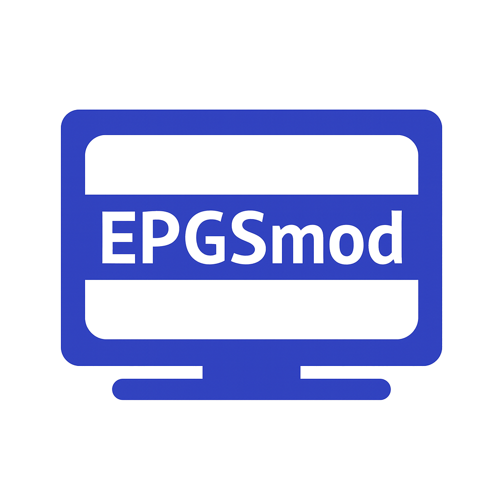

# EPGSmod

テレビ録画管理サーバー EPGStationの強力な機能を最大限に活用するための、シンプルで使いやすい録画予約支援フロントエンドツールです。Node.js (Express) プロキシと連携し、複雑なAPI操作を直感的なWeb UIで提供します。

## 概要

本ツールは、ユーザーフレンドリーなWebインターフェースを通じて、EPGStationの以下の操作を効率化します。

*  番組表からのキーワード抽出と即時ルール追加。

*  録画競合（コンフリクト）の視覚化と解決。

*  既存の予約ルールの効率的な管理と確認。

## 動作要件

* EPGStation v2

## 動作環境

* バックエンド: Node.js (Express, axios)
* フロントエンド: HTML, JavaScript (ピュアJS)
* デプロイ: Docker (--network host または適切なネットワーク設定)

## インストール

sudo docker run -d --network host --name epgsmod --restart unless-stopped ghcr.io/takyao/epgsmod:latest

環境変数 PORT が設定(-e PORT=3002)されていればそれを使用し、なければ 3001 をデフォルトとして使用する

ブラウザで。http://localhost:3001 にアクセスし、画面上部でEPGStationのAPI URLを設定・保存してください

## 解説

[テレビ録画メディアサーバー構築入門（第２６回）](https://note.com/leal_walrus5520/n/ncaf1feb3808c)

