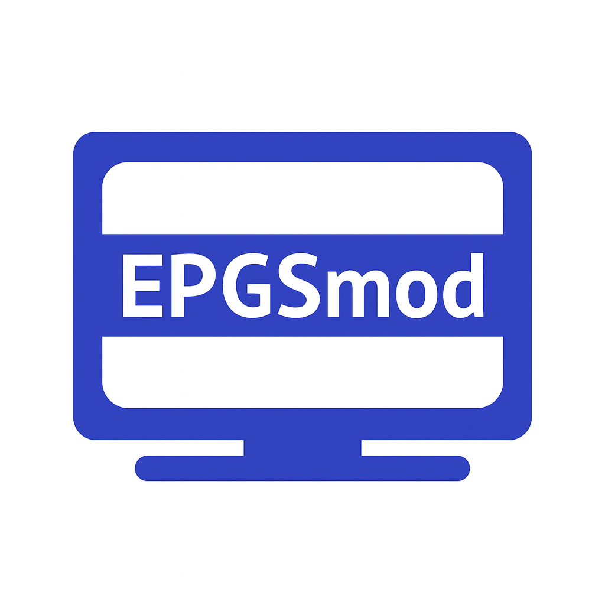
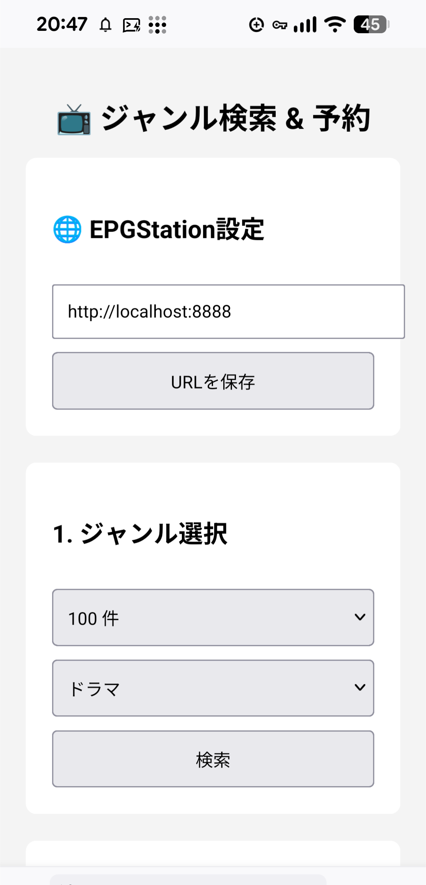

# EPGSmod

テレビ録画管理サーバー EPGStation の使い勝手をよくする支援ツール。

1. ジャンルごとに、放送される番組のリストを一括取得し、
2. リストから選択した番組一話（エピソード）から、「番組名」を抽出して、
3. 抽出した「番組名」をキーワードとして、録画ルールに追加する

スマホ利用を想定して、文字入力の手間を省くための便利ツール。

## 動作要件

**EPGStation v2** 
https://github.com/l3tnun/EPGStation   
  
## インストール

sudo docker run -d --network host --name epgsmod --restart unless-stopped ghcr.io/takyao/epgsmod:latest

## 使用法

ブラウザで3001ポートにアクセス。http://localhost:3001

EPGStationの URL:port を入力する。

番組改編期に、新番組（シリーズ）の録画予約に使える。

選択した「番組名」にて、ワンクリックでネット検索できる。

予約の競合を、ワンクリックで解消できる。

## 解説記事

[テレビ録画メディアサーバー構築入門（第２６回）](https://note.com/leal_walrus5520/n/ncaf1feb3808c)

